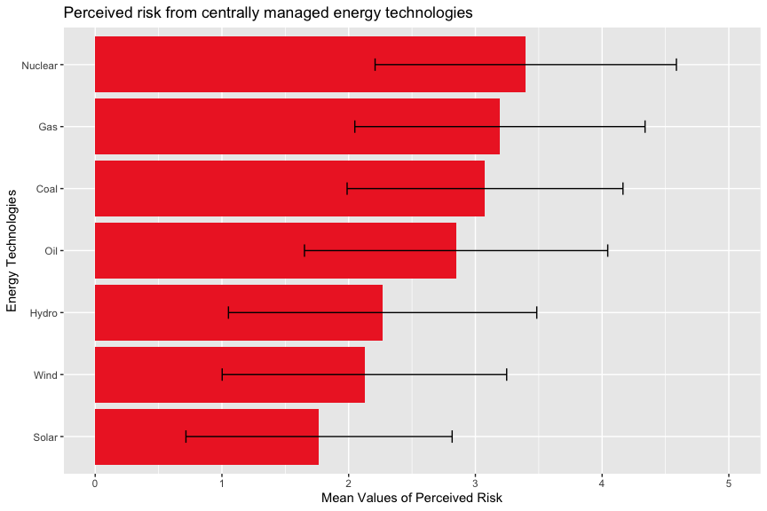
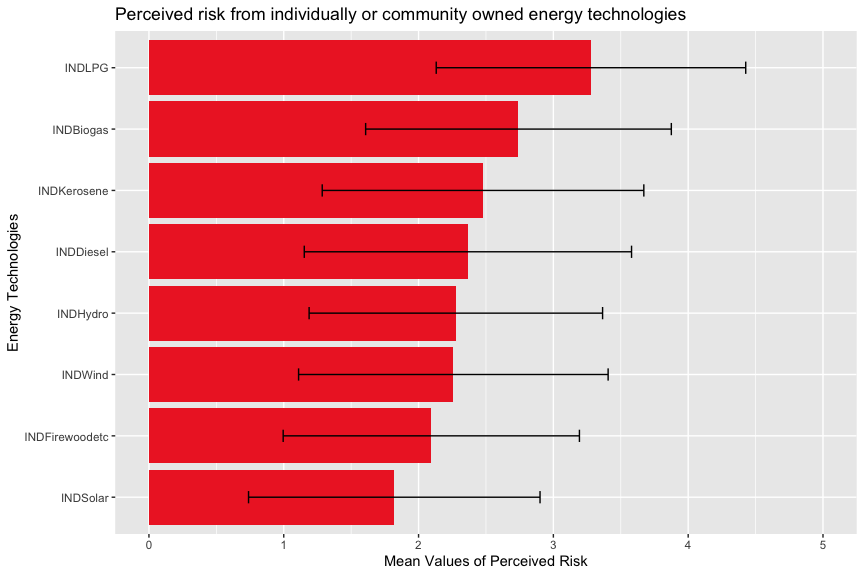
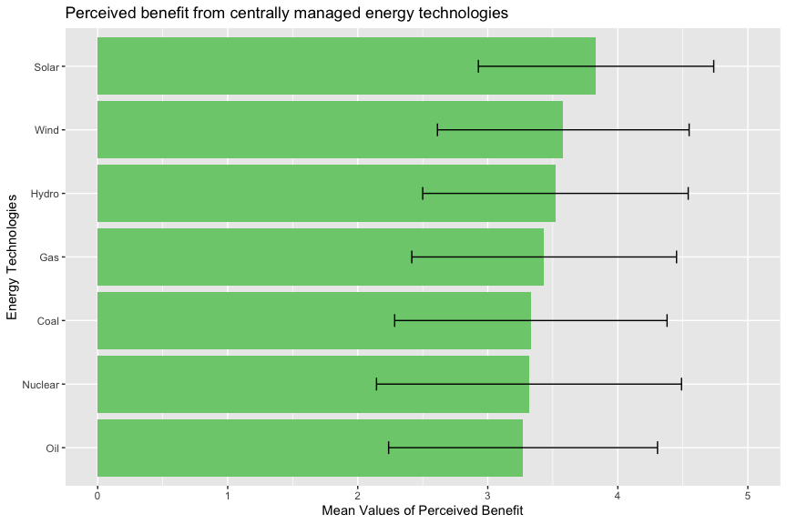
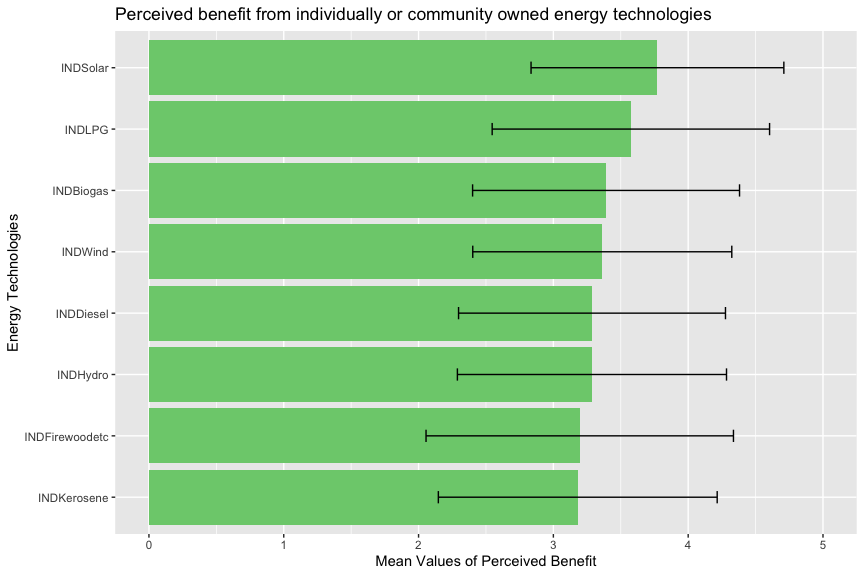
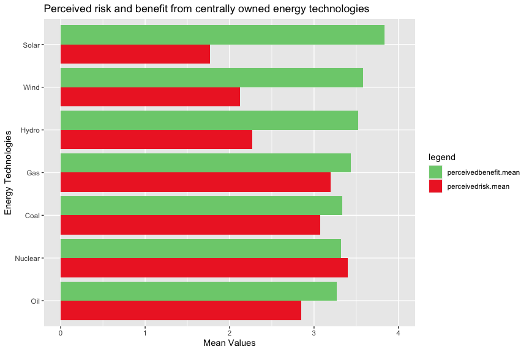
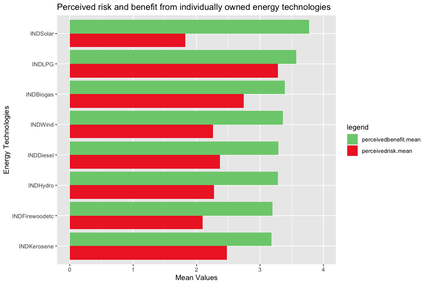

---
pdf_document:
  toc: yes
  number_sections: yes
  toc_depth: 2
  fig_width: 9
  fig_height: 6
  fig_caption: yes
output:
  html_document:
    fig_width: 9
    fig_height: 6
    fig_caption: yes
    keep_md: yes
    theme: paper
    df_print: paged
  pdf_document: default
title: "Dependent Variable Graphs"
---

## Q1. Below is a list of various centrally managed sources of energy. How risky are each of these energy technologies according to you?  Please tell me whether you see each technology as: not at all risky(1), slightly risky(2), moderately risky(3), very risky(4), or extremely risky(5)

  

<!-- -->

## Q2. Following is a list of various individually or community-owned and managed sources of energy. How risky are each of these energy technologies according to you? Please tell me whether you see each technology as: not at all risky(1), slightly risky(2), moderately risky(3), very risky(4), or extremely risky(5). 

prefix IND stands for individually or community-owned and managed. 

  

<!-- -->

## Q3. Following is a list of centrally managed sources of energy. How beneficial are each of these according to you? Please tell me whether you see each technology as: not at all beneficial(1), slightly beneficial(2), moderately beneficial(3), very beneficial(4), or extremely beneficial(5)?

  

<!-- -->

## Q4. Following is a list of various individually or community owned and managed sources of energy. How beneficial are each of these according to you? Please tell me whether you see each technology as: not at all beneficial(1), slightly beneficial(2), moderately beneficial(3), very beneficial(4) or extremely beneficial(5) ?

prefix IND stands for individually or community-owned and managed. 

  

<!-- -->

<!-- -->

Prefix IND stands for individually or community-owned and managed. 

<!-- -->

