\newpage

## Perceived Risk Scores for all centrally managed energy technologies(nuclear energy, hydroelectric dam, solar energy, wind energy, coal, gas and oil) by gender and caste groups 

OBC = Other Backward Classes;
SC = Scheduled Castes;
ST = Scheduled Tribes

  

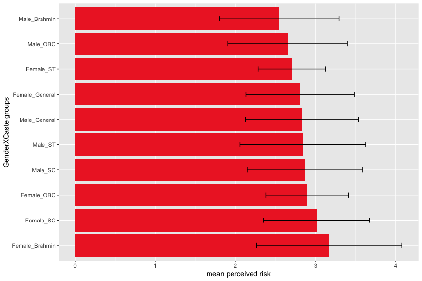<!-- -->

\newpage

## Perceived Benefit Scores for all centrally managed energy technologies(nuclear energy, hydroelectric dam, solar energy, wind energy, coal, gas and oil) by gender and caste groups 

OBC = Other Backward Classes;
SC = Scheduled Castes;
ST = Scheduled Tribes;

  

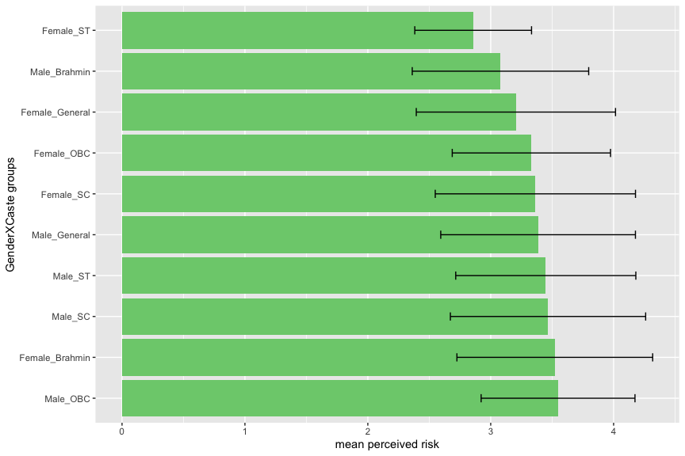<!-- -->

\newpage

## Perceived Risk Scores for all individually or community owned energy technologies(small hydro, rooftop solar, windmill, biogas, diesel, kerosene,Firewood/cow dung/crop residue/ coal/charcoal, LPG) by gender and caste groups 

OBC = Other Backward Classes
SC = Scheduled Castes
ST = Scheduled Tribes

  

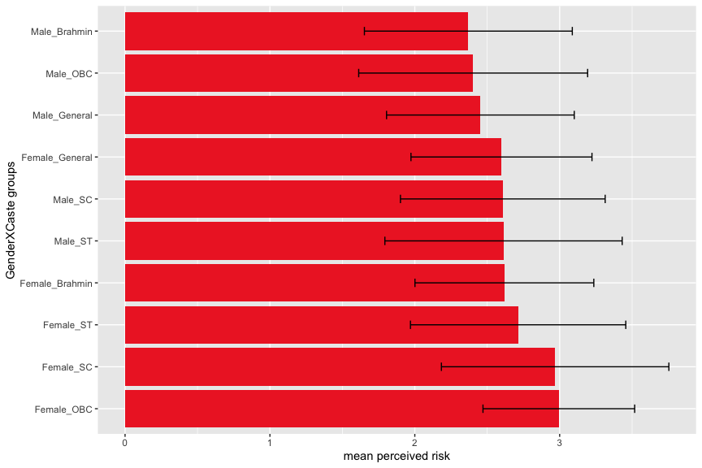<!-- -->

\newpage 

## Perceived Benefit Scores for all individually or community owned energy technologies(small hydro, rooftop solar, windmill, biogas, diesel, kerosene,Firewood/cow dung/crop residue/ coal/charcoal, LPG) by gender and caste groups 

OBC = Other Backward Classes;
SC = Scheduled Castes;
ST = Scheduled Tribes

  

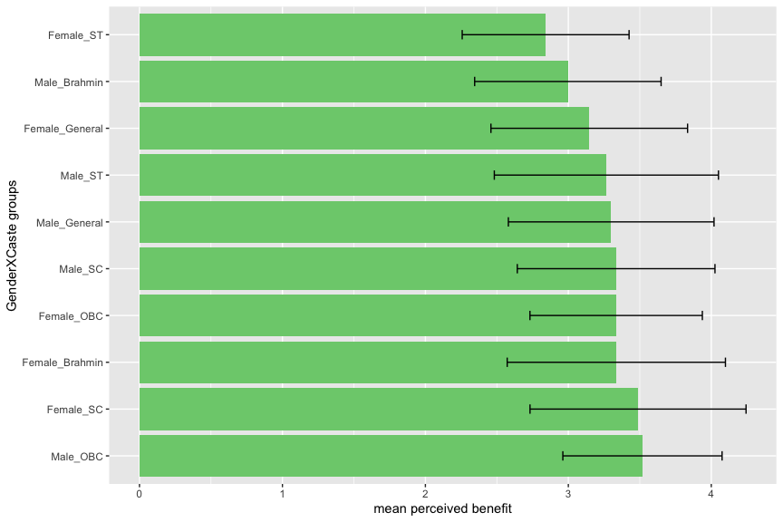<!-- -->

\newpage
## Perceived Risk Scores for centrally managed hydroelectric dams by gender and caste groups 

OBC = Other Backward Classes;
SC = Scheduled Castes;
ST = Scheduled Tribes

  

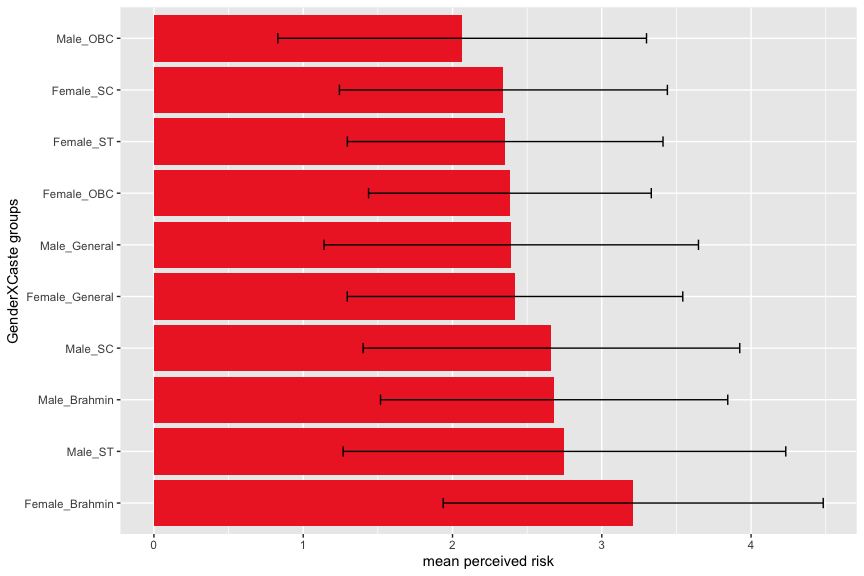<!-- -->

\newpage

## Perceived Benefit Scores for centrally managed hydroelectric dams by gender and caste groups 

OBC = Other Backward Classes;
SC = Scheduled Castes;
ST = Scheduled Tribes

  

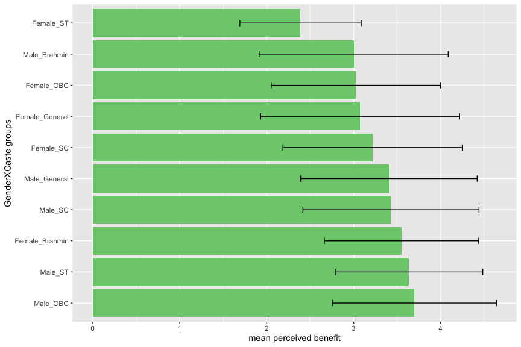<!-- -->

\newpage
## Perceived Risk Scores for all centrally managed energy technologies(nuclear energy, hydroelectric dam, solar energy, wind energy, coal, gas and oil) by urban or rural location of the respondent 

  

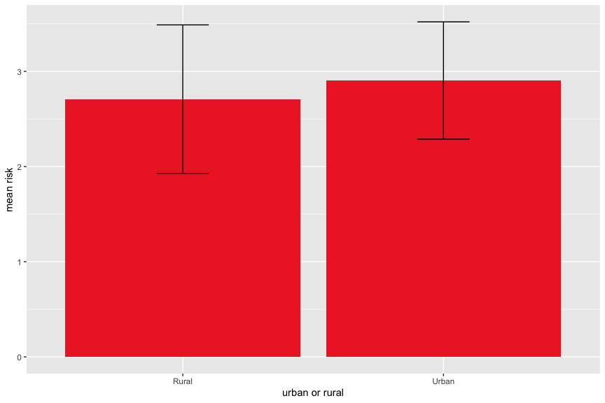<!-- -->

\newpage
## Perceived Benefit Scores for all centrally managed energy technologies(nuclear energy, hydroelectric dam, solar energy, wind energy, coal, gas and oil) by urban or rural location of the respondent 

  

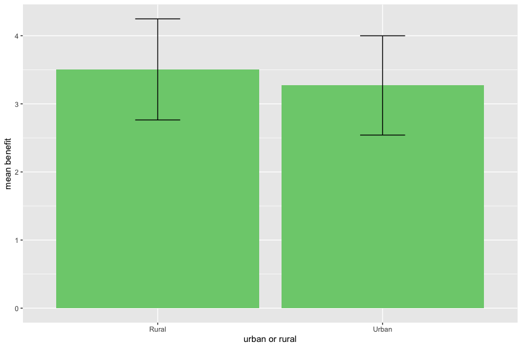<!-- -->

\newpage

## Perceived Risk Scores for all centrally managed energy technologies(nuclear energy, hydroelectric dam, solar energy, wind energy, coal, gas and oil) by gender

  

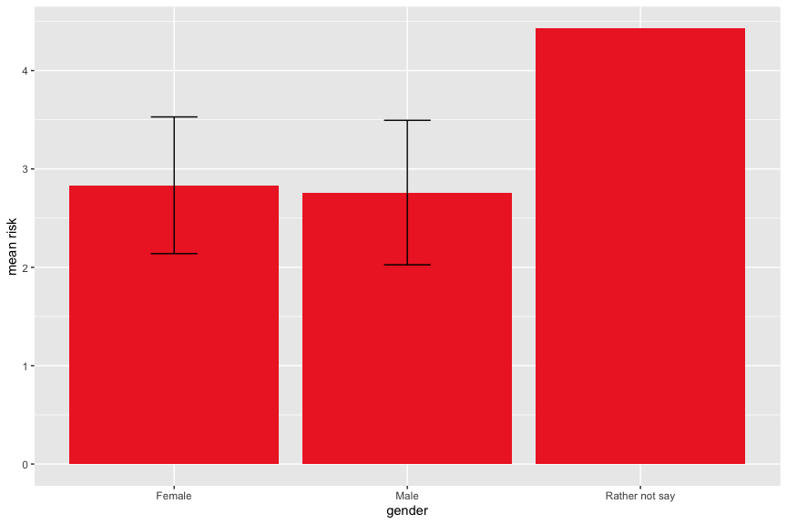<!-- -->

\newpage

## Perceived Benefit Scores for all centrally managed energy technologies(nuclear energy, hydroelectric dam, solar energy, wind energy, coal, gas and oil) by gender

  

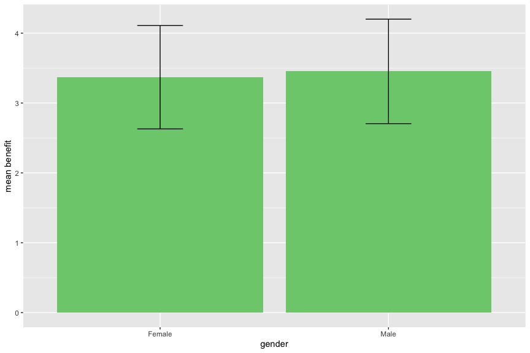<!-- -->

\newpage

## Perceived Risk Scores for all individually or community owned energy technologies(small hydro, rooftop solar, windmill, biogas, diesel, kerosene,Firewood/cow dung/crop residue/ coal/charcoal, LPG) by gender. 

  

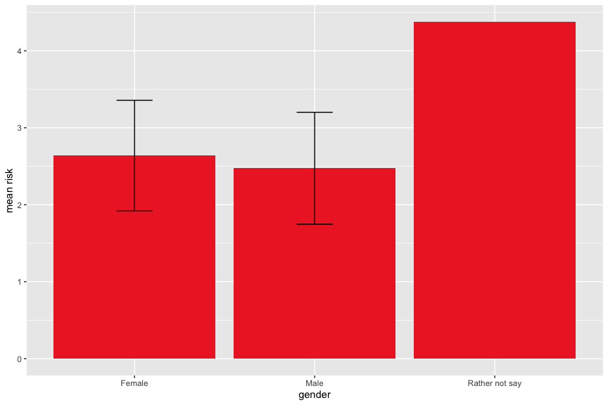<!-- -->

\newpage

## Perceived Benefit Scores for all individually or community owned energy technologies(small hydro, rooftop solar, windmill, biogas, diesel, kerosene,Firewood/cow dung/crop residue/ coal/charcoal, LPG) by gender. 

  

<!-- -->

\newpage

## Perceived Risk Scores for all centrally managed energy technologies(nuclear energy, hydroelectric dam, solar energy, wind energy, coal, gas and oil) by religion

  

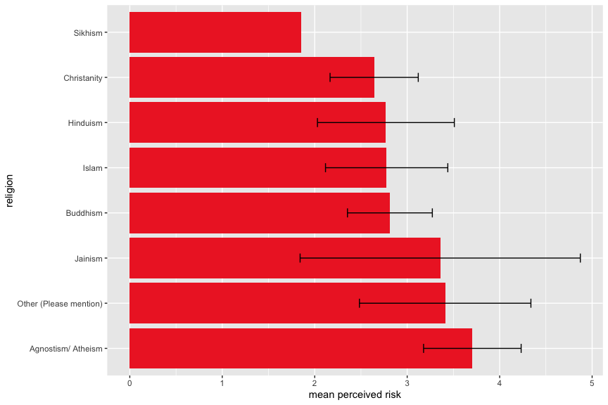<!-- -->

\newpage

## Perceived Benefit Scores for all centrally managed energy technologies(nuclear energy, hydroelectric dam, solar energy, wind energy, coal, gas and oil) by religion

  

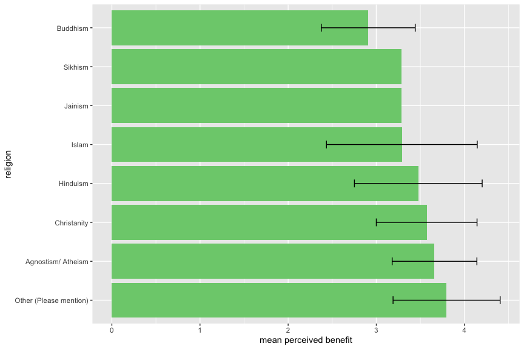<!-- -->

\newpage

## Perceived Risk Scores for all individually or community owned energy technologies(small hydro, rooftop solar, windmill, biogas, diesel, kerosene,Firewood/cow dung/crop residue/ coal/charcoal, LPG) by religion. 

  

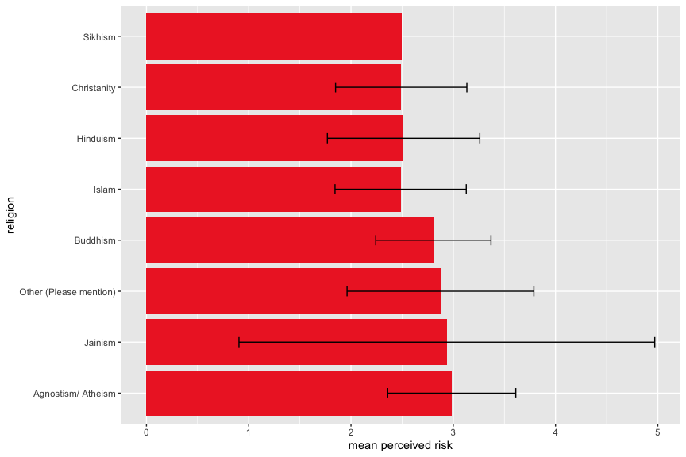<!-- -->

\newpage
## Perceived Benefit Scores for all individually or community owned energy technologies(small hydro, rooftop solar, windmill, biogas, diesel, kerosene,Firewood/cow dung/crop residue/ coal/charcoal, LPG) by religion. 

  

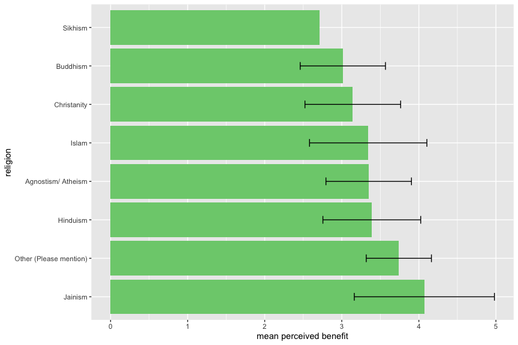<!-- -->

\newpage

## Perceived Risk Scores for all centrally managed energy technologies(nuclear energy, hydroelectric dam, solar energy, wind energy, coal, gas and oil) by age

  

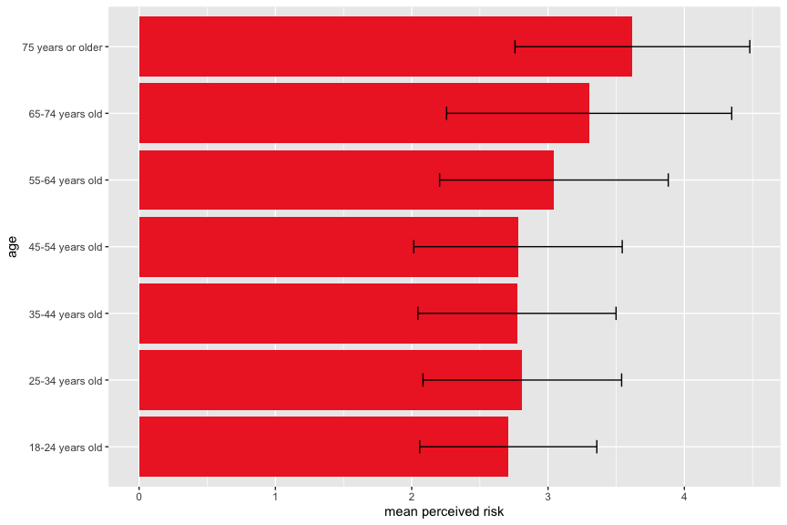<!-- -->

\newpage

## Perceived Benefit Scores for all centrally managed energy technologies(nuclear energy, hydroelectric dam, solar energy, wind energy, coal, gas and oil) by age

  

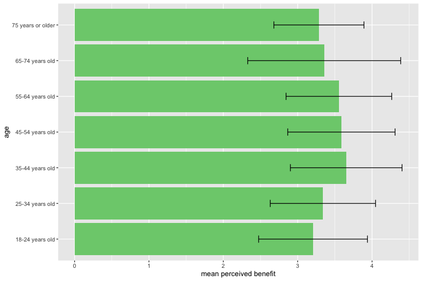<!-- -->

\newpage

## Perceived Risk Scores for all individually or community owned energy technologies(small hydro, rooftop solar, windmill, biogas, diesel, kerosene,Firewood/cow dung/crop residue/ coal/charcoal, LPG) by age. 

  

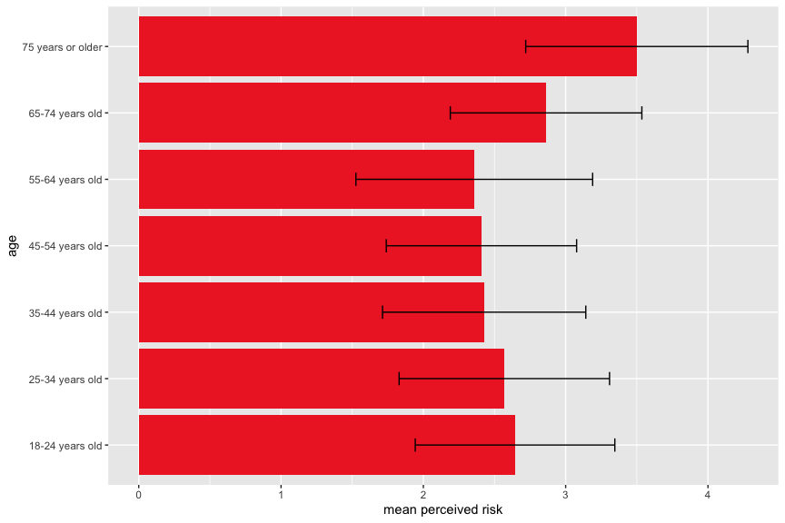<!-- -->

\newpage

## Perceived Benefit Scores for all individually or community owned energy technologies(small hydro, rooftop solar, windmill, biogas, diesel, kerosene,Firewood/cow dung/crop residue/ coal/charcoal, LPG) by age. 

  

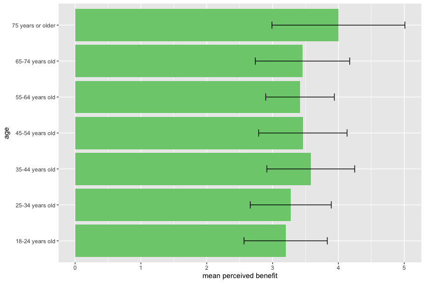<!-- -->

\newpage

## Perceived Risk Scores for all centrally managed energy technologies(nuclear energy, hydroelectric dam, solar energy, wind energy, coal, gas and oil) by state

  

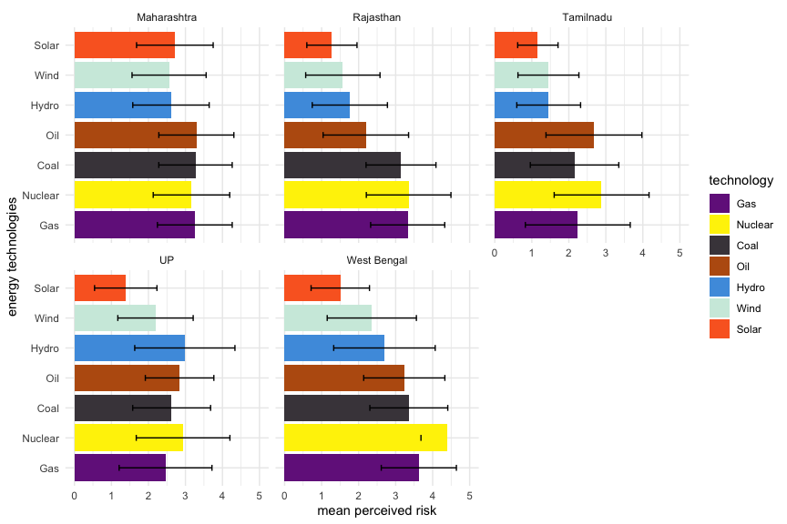<!-- -->

\newpage
## Perceived Benefit Scores for all centrally managed energy technologies(nuclear energy, hydroelectric dam, solar energy, wind energy, coal, gas and oil) by state

  

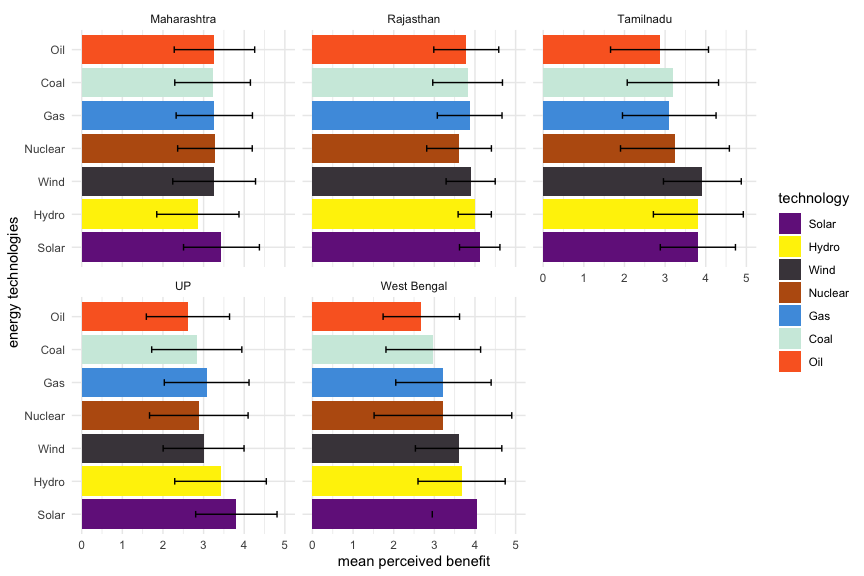<!-- -->

