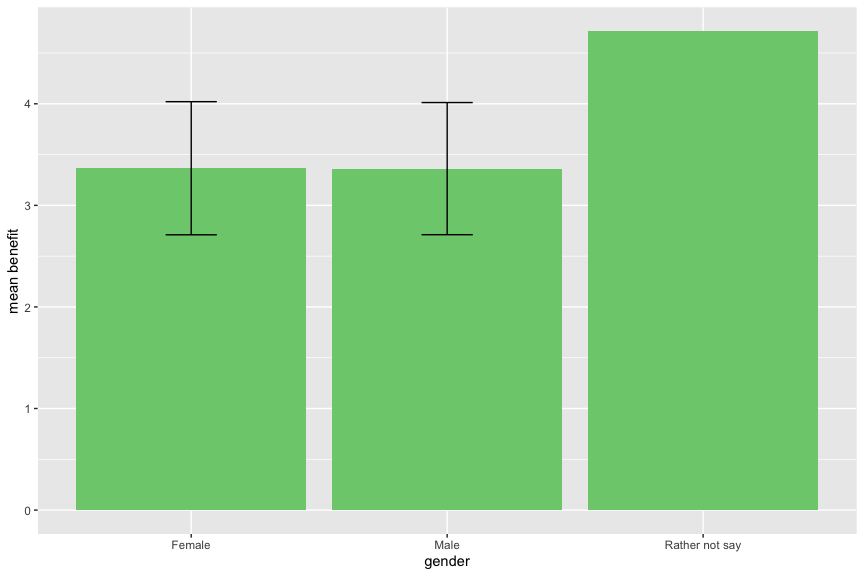

## Perceived Risk Scores for all centrally managed energy technologies(nuclear energy, hydroelectric dam, solar energy, wind energy, coal, gas and oil) by gender and caste groups 

OBC = Other Backward Classes
SC = Scheduled Castes
ST = Scheduled Tribes

<!-- -->

## Perceived Benefit Scores for all centrally managed energy technologies(nuclear energy, hydroelectric dam, solar energy, wind energy, coal, gas and oil) by gender and caste groups 

OBC = Other Backward Classes
SC = Scheduled Castes
ST = Scheduled Tribes

<!-- -->

## Perceived Risk Scores for all individually or community owned energy technologies(small hydro, rooftop solar, windmill, biogas, diesel, kerosene,Firewood/cow dung/crop residue/ coal/charcoal, LPG) by gender and caste groups 

OBC = Other Backward Classes
SC = Scheduled Castes
ST = Scheduled Tribes

<!-- -->

## Perceived Benefit Scores for all individually or community owned energy technologies(small hydro, rooftop solar, windmill, biogas, diesel, kerosene,Firewood/cow dung/crop residue/ coal/charcoal, LPG) by gender and caste groups 

OBC = Other Backward Classes
SC = Scheduled Castes
ST = Scheduled Tribes

<!-- -->

## Perceived Risk Scores for centrally managed hydroelectric dams by gender and caste groups 

OBC = Other Backward Classes
SC = Scheduled Castes
ST = Scheduled Tribes

<!-- -->
## Perceived Benefit Scores for centrally managed hydroelectric dams by gender and caste groups 

OBC = Other Backward Classes
SC = Scheduled Castes
ST = Scheduled Tribes

<!-- -->

## Perceived Risk Scores for all centrally managed energy technologies(nuclear energy, hydroelectric dam, solar energy, wind energy, coal, gas and oil) by urban or rural location of the respondent 

<!-- -->

## Perceived Benefit Scores for all centrally managed energy technologies(nuclear energy, hydroelectric dam, solar energy, wind energy, coal, gas and oil) by urban or rural location of the respondent 

<!-- -->

## Perceived Risk Scores for all centrally managed energy technologies(nuclear energy, hydroelectric dam, solar energy, wind energy, coal, gas and oil) by gender

<!-- -->

## Perceived Benefit Scores for all centrally managed energy technologies(nuclear energy, hydroelectric dam, solar energy, wind energy, coal, gas and oil) by gender

<!-- -->

## Perceived Risk Scores for all individually or community owned energy technologies(small hydro, rooftop solar, windmill, biogas, diesel, kerosene,Firewood/cow dung/crop residue/ coal/charcoal, LPG) by gender. 

<!-- -->

## Perceived Risk Scores for all individually or community owned energy technologies(small hydro, rooftop solar, windmill, biogas, diesel, kerosene,Firewood/cow dung/crop residue/ coal/charcoal, LPG) by gender. 

<!-- -->

## Perceived Risk Scores for all centrally managed energy technologies(nuclear energy, hydroelectric dam, solar energy, wind energy, coal, gas and oil) by religion

<!-- -->

## Perceived Benefit Scores for all centrally managed energy technologies(nuclear energy, hydroelectric dam, solar energy, wind energy, coal, gas and oil) by religion

<!-- -->

## Perceived Risk Scores for all individually or community owned energy technologies(small hydro, rooftop solar, windmill, biogas, diesel, kerosene,Firewood/cow dung/crop residue/ coal/charcoal, LPG) by religion. 

<!-- -->

## Perceived Benefit Scores for all individually or community owned energy technologies(small hydro, rooftop solar, windmill, biogas, diesel, kerosene,Firewood/cow dung/crop residue/ coal/charcoal, LPG) by religion. 

<!-- -->

## Perceived Risk Scores for all centrally managed energy technologies(nuclear energy, hydroelectric dam, solar energy, wind energy, coal, gas and oil) by age

<!-- -->

## Perceived Benefit Scores for all centrally managed energy technologies(nuclear energy, hydroelectric dam, solar energy, wind energy, coal, gas and oil) by age
<!-- -->

## Perceived Risk Scores for all individually or community owned energy technologies(small hydro, rooftop solar, windmill, biogas, diesel, kerosene,Firewood/cow dung/crop residue/ coal/charcoal, LPG) by age. 

<!-- -->

## Perceived Risk Scores for all individually or community owned energy technologies(small hydro, rooftop solar, windmill, biogas, diesel, kerosene,Firewood/cow dung/crop residue/ coal/charcoal, LPG) by age. 

<!-- -->

## Perceived Risk Scores for all centrally managed energy technologies(nuclear energy, hydroelectric dam, solar energy, wind energy, coal, gas and oil) by state

<!-- -->

## Perceived Benefit Scores for all centrally managed energy technologies(nuclear energy, hydroelectric dam, solar energy, wind energy, coal, gas and oil) by state

<!-- -->

## Perceived Risk Scores for all individually or community owned/managed energy technologies(small hydro, rooftop solar, windmill, biogas, diesel, kerosene,Firewood/cow dung/crop residue/ coal/charcoal, LPG) by state
<!-- -->

## Perceived Benefit Scores for all individually or community owned/managed energy technologies(small hydro, rooftop solar, windmill, biogas, diesel, kerosene,Firewood/cow dung/crop residue/ coal/charcoal, LPG) by state

<!-- -->

